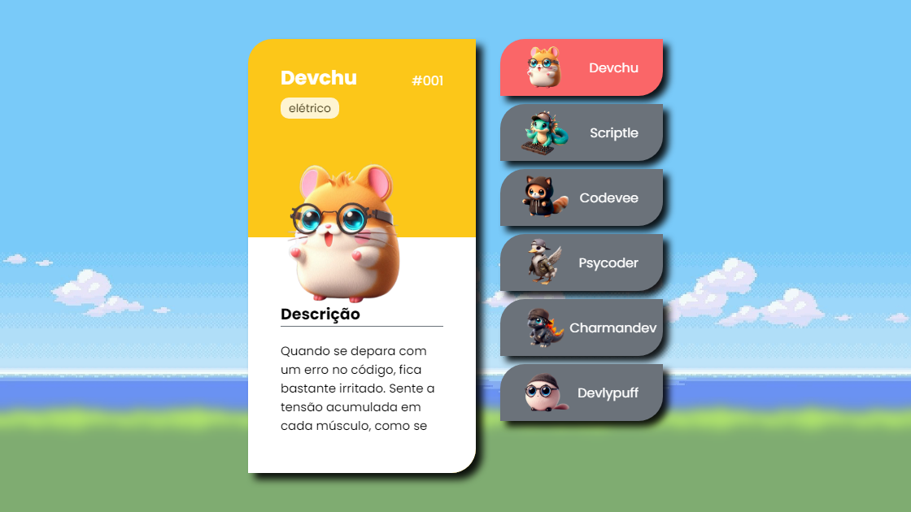

# Pokedevs -  🚀 🚀

Bem-vindo ao projeto Pokedevs! Este é um projeto divertido e interativo que apresenta uma série de personagens inspirados em Pokémon, cada um representando um arquétipo de desenvolvedor. O projeto foi desenvolvido para a "Semana do Zero ao Programador Contratado" com o objetivo de praticar habilidades de front-end.

## Sobre o Projeto 💡

Pokedevs é uma aplicação web que exibe cartões de personagens, cada um representando um tipo diferente de desenvolvedor, com características e descrições únicas. O objetivo é criar uma experiência divertida e educativa que demonstre o uso de HTML, CSS e JavaScript para criar interfaces dinâmicas.

O projeto apresenta:

*   **Cartões Interativos:** Cartões com informações detalhadas sobre cada "Pokedev".
*   **Navegação por Lista:** Uma lista interativa de "Pokedevs" que permite alternar entre os cartões.
*   **Layout Responsivo:** Uma interface que se adapta a diferentes tamanhos de tela, desde desktops até dispositivos móveis.
*   **Animações e Efeitos:** Utilização de animações para realçar a interatividade da página.

## Funcionalidades 🛠️

O projeto Pokedevs implementa as seguintes funcionalidades principais:

1.  **Exibição de Cartões:**
    *   Cada cartão exibe um "Pokedev" com seu nome, número, tipo, imagem e descrição.
    *   Os cartões têm um design visualmente atraente, com cores e elementos que refletem seus tipos.
2.  **Navegação por Lista:**
    *   Uma lista lateral com miniaturas dos "Pokedevs".
    *   Ao clicar em um item da lista, o cartão correspondente é exibido.
    *   O item ativo na lista é destacado visualmente.
3.  **Responsividade:**
    *   O layout se adapta a diferentes tamanhos de tela, proporcionando uma boa experiência em diversos dispositivos.
    *   Ajuste de layout e tamanho de elementos para melhor visualização em telas menores.
4.  **Interatividade:**
    *   Utilização de JavaScript para controlar a exibição dos cartões e o destaque do item ativo na lista.
    *   Transições suaves entre os cartões.

## Tecnologias Utilizadas ⚙️

Este projeto foi desenvolvido usando:

*   **HTML5:** Para a estrutura do site e conteúdo.
*   **CSS3:** Para o estilo, design, responsividade e animações.
*   **JavaScript:** Para a interatividade da lista e exibição dos cartões.
*   **Google Fonts:** Para a tipografia.

## Como Usar 🚀

Clique no botão abaixo para acessar:

---

## Código Fonte 💻

Para explorar o código-fonte e contribuir com o projeto, acesse:

[Repositório do Pokedevs](https://github.com/Domisnnet/pokedevs)

## Créditos 📝

*   **Desenvolvedor:** <strong>DomisDev.</strong>
*   **Design:** Inspirado em Pokémon e desenvolvido para a "Semana do Zero ao Programador Contratado".
*   **Fontes:** Google Fonts.

## Contribuindo 🤝

Contribuições são sempre bem-vindas! Se você deseja contribuir com este projeto, siga estes passos:

1.  Faça um fork do repositório.
2.  Crie uma branch para suas mudanças (`git checkout -b minha-contribuicao`).
3.  Faça suas alterações e commits (`git commit -am 'Adicione minha contribuição'`).
4.  Envie suas alterações para o seu fork (`git push origin minha-contribuicao`).
5.  Abra um Pull Request para o repositório original.

## FAQ 🤔

**Pergunta 1:** Como faço para ver os outros "Pokedevs"?

   **Resposta:** Use a lista lateral de "Pokedevs". Ao clicar em um nome, o cartão correspondente será exibido.

**Pergunta 2:** Posso usar este projeto como base para meus projetos?

   **Resposta:** Sim, o código está disponível no GitHub e você pode usá-lo como base para seus projetos, lembrando de dar os créditos apropriados.

**Pergunta 3:** Como posso entrar em contato com o desenvolvedor?

   **Resposta:** Você pode entrar em contato através do perfil do GitHub: 

<a href="https://github.com/Domisnnet">
    
    DomisDev
</a> 

---

Aproveite a experiência interativa com Pokedevs! 🚀